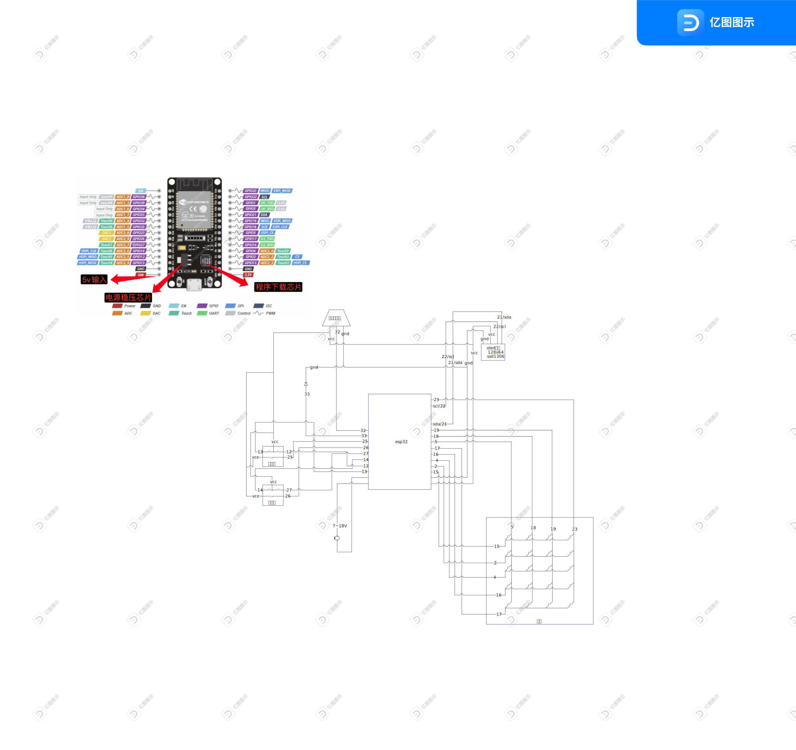

<h1 align="center">ESP32蓝牙键盘</h1>
<h2 align="center">适用于30pin的esp32或者esp32s模块</h2>

## 环境
MicroPython v1.24.1或以上，使用[官方固件](https://micropython.org/download/ESP32_GENERIC/)
- 512 kB SRAM or more
- 4MiB flash

## 原因
1. 想要一个可自定义功能的小键盘
2. 辅助一些复制、粘贴、切换桌面之类的快捷键日常使用
3. 帮助一些常用软件的的使用，如PS、OBS、L2D
4. esp32的价格比直接买别人做好的便宜很多
5. 初次接触可编程硬件，简单学习一下

## 硬件
- 自动复位按键
- esp32模组
- ssd1306 oled显示屏128x64
- 无源蜂鸣器
- 旋钮x2
- 杜邦线若干

## 功能
1.蓝牙hid通信
1. 蓝牙数字小键盘
2. 亮度、音量调整
3. 快捷键定义
4. 按键宏定义
5. 音乐小键盘
6. 按键防误触
7. mac和win使用切换

## 配置方法
1. 按照接线图连接esp32模组和ssd1306 oled显示屏等其他元件
   - 
2. 前往[官网](https://micropython.org/download/ESP32_GENERIC/)下载MicroPython固件
3. 下载并安装[thonny](https://thonny.org/)，使用它将MicroPython固件烧录到esp32模组中
4. 下载本项目代码，通过thonny将代码上传到esp32模组中

## 引用
- 蓝牙
  - [MicroPythonBLEHID](https://github.com/Heerkog/MicroPythonBLEHID)，作者：[Heerkog](https://github.com/Heerkog)
- ssd1306 oled 中文显示
  - [MicroPython-uFont](https://github.com/AntonVanke/MicroPython-uFont)，作者：[AntonVanke](https://github.com/AntonVanke)